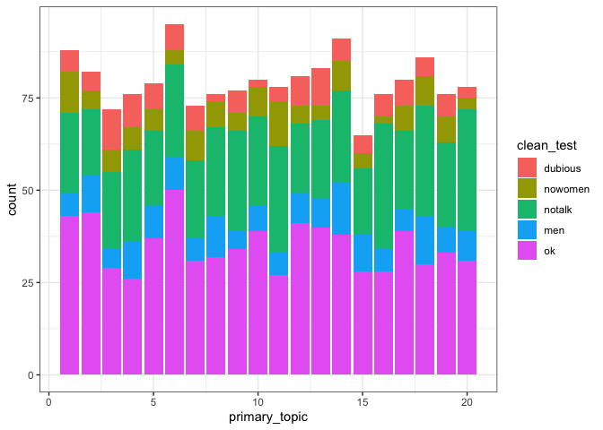

movie\_topic\_bechdel
================
Hao Ye
3/9/2021

# Setup

``` r
library(tidyverse)
```

    ## ── Attaching packages ─────────────────────────────────────── tidyverse 1.3.0 ──

    ## ✓ ggplot2 3.3.2     ✓ purrr   0.3.4
    ## ✓ tibble  3.0.6     ✓ dplyr   1.0.2
    ## ✓ tidyr   1.1.2     ✓ stringr 1.4.0
    ## ✓ readr   1.4.0     ✓ forcats 0.5.0

    ## ── Conflicts ────────────────────────────────────────── tidyverse_conflicts() ──
    ## x dplyr::filter() masks stats::filter()
    ## x dplyr::lag()    masks stats::lag()

``` r
library(topicmodels)

movies <- readRDS(here::here("2021-03-09/movies.RDS"))
```

# Data Processing

## construct document term matrix from movie plots

``` r
library(tm)
```

    ## Loading required package: NLP

    ## 
    ## Attaching package: 'NLP'

    ## The following object is masked from 'package:ggplot2':
    ## 
    ##     annotate

``` r
movies_plot_dat <- select(movies, doc_id = imdb, text = plot)
movies_corpus <- VCorpus(DataframeSource(movies_plot_dat))
movies_dtm <- DocumentTermMatrix(movies_corpus, 
                                 control = list(removePunctuation = TRUE, 
                                                stopwords = TRUE))
## filter movies with zero terms (empty plot text?)
dtm_zero_idx <- apply(movies_dtm, 1, sum) == 0
movies_dtm <- movies_dtm[!dtm_zero_idx,]
```

## compute topic model

``` r
num_topics <- 20
movies_TM <- LDA(movies_dtm, num_topics)
```

## extract out topic info

``` r
movies_id <- movies_TM@documents
movies_gamma <- movies_TM@gamma
movies_topics <- terms(movies_TM, 5)
```

## assemble data

``` r
primary_topic <- topics(movies_TM)
movies_dat <- data.frame(id = movies_id, 
                         primary_topic = primary_topic)
colnames(movies_gamma) <- paste("topic", seq(num_topics))
movies_dat <- cbind(movies_dat, movies_gamma) %>%
    left_join(movies, by = c("id" = "imdb")) %>%
    mutate(clean_test = fct_relevel(clean_test, "dubious", "nowomen", "notalk", "men", "ok"))
```

# Plot

## bechdel results by primary topic

``` r
ggplot(movies_dat, 
       aes(x = primary_topic, 
           fill = clean_test)) + 
    geom_bar() + 
    theme_bw()
```

<!-- -->

## topic term table

``` r
knitr::kable(movies_topics)
```

| Topic 1 | Topic 2  | Topic 3 | Topic 4 | Topic 5 | Topic 6 | Topic 7 | Topic 8 | Topic 9 | Topic 10 | Topic 11 | Topic 12 | Topic 13 | Topic 14 | Topic 15 | Topic 16 | Topic 17 | Topic 18 | Topic 19 | Topic 20  |
| :------ | :------- | :------ | :------ | :------ | :------ | :------ | :------ | :------ | :------- | :------- | :------- | :------- | :------- | :------- | :------- | :------- | :------- | :------- | :-------- |
| couple  | home     | high    | must    | job     | woman   | young   | order   | brother | girl     | crew     | town     | love     | agent    | evil     | angeles  | group    | son      | world    | finds     |
| life    | former   | school  | future  | new     | young   | woman   | forces  | one     | king     | must     | woman    | friends  | alien    | years    | los      | become   | discover | cia      | detective |
| married | new      | life    | accused | city    | family  | war     | begins  | father  | earth    | team     | small    | guy      | group    | camp     | young    | one      | family   | life     | life      |
| new     | children | english | stop    | york    | man     | new     | find    | life    | new      | find     | men      | two      | people   | young    | death    | car      | find     | police   | ruthless  |
| student | young    | becomes | help    | world   | killer  | man     | group   | based   | young    | agent    | friends  | lives    | finds    | can      | finds    | accident | story    | special  | young     |
